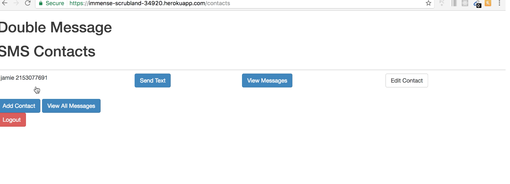

# doubleMessage
A messaging app, primarily using Twilio webhooks and OAuth APIs.
This app has been pushed to heroku, at link https://immense-scrubland-34920.herokuapp.com .

The app has several features highlighting the different ways of logging into an application. Using OAuth, logging in using either Twitter or Facebook is easy!

You can log in 1 of 3 ways:
- Traditional (data is stored in a MongoDB)
- Facebook
- Twitter

## Traditional Login

When you log in, you see your contact list. You are able to add and edit contacts, as well as send them messsages. 

For the purpose of this app,
messages were able to be sent between my Twilio number and cell phone number, both registered with a Twilio API developer account. The messages were sent using webhooks.

## Facebook Login
If you decide to login using Facebook, the app will bring you to authorize doubleMessage to use the necessary Facebook information. After you do this, you will be redirected back to the home page as a logged in user!

## Twitter Login
Logging in with Twitter gives you a little more functionality than Facebook, makign use of Twitter's APIs. After authorizing doubleMessage with Twitter, you will be redirected to a newer looking homepage.

You are able to import your Followers and your Direct Messages, and see them both in the app.

## Technologies
- MongoDB database
- passport
- handlebars
- Node.js
- request response cycle http
- Twillio Node Client
- webhooks (use heroku to do so)
- OAuth (Facebook and Twitter login)
- API (twitter)
